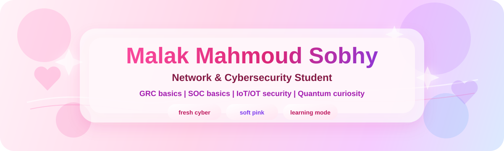

 

 

  

## Intro

Hi, I'm **Malak Sobhy**, a Network and Cybersecurity student at ElSewedy University of Technology.

I'm passionate about building secure systems, understanding how technology works, and solving real-world problems through cybersecurity.

My goal is to build strong foundations in **Cybersecurity, Networks, GRC, SOC, and OT/IoT Security** while combining technology with leadership, sustainability, and real-world impact.

I believe success isn't measured only by personal achievements. To me, real success is creating solutions that help people, strengthen communities, and leave a positive impact.

<table>
<tr>
<td width="50%" valign="top">

### Learning Now

* Network Security & Defense
* Linux & Security Tools
* GRC, Risk Assessment & Compliance
* SOC Fundamentals & Threat Detection
* Secure Coding & System Hardening

</td>
<td width="50%" valign="top">

### Favorite Areas

* Cybersecurity & Network Security
* GRC & Security Governance
* OT/IoT & Industrial Security
* Smart Cities & Emerging Technologies
* Quantum Computing, Mathematics & Physics

</td>
</tr>
</table>

## My Vision

I believe cybersecurity is about more than protecting systems—it's about protecting people, businesses, and communities.

I aspire to build secure, practical, and meaningful solutions while continuously learning, sharing knowledge, and creating technology that leaves a positive impact.

## Experience

### Cybersecurity Trainee - MCV, Manufacturing Commercial Vehicles

**Jun 2025 - Aug 2025**

* Explored cybersecurity in a real industrial environment.
* Learned about OT/IT integration, industrial networks, and enterprise security.
* Worked on GRC concepts including risk management, compliance, security policies, and security awareness.
* Practiced identifying risks, understanding security controls, and thinking from a security analyst's perspective.

## Projects

### LUXORA - Smart Waste Management System

AI and IoT-based Smart Waste Management System focused on sustainability, automation, and real-time monitoring.

**My Contributions**

* Led and coordinated team activities.
* Planned system workflow and project structure.
* Contributed to dashboard and monitoring concepts.
* Focused on cybersecurity, scalability, sustainability, and practical implementation.

## Tech Stack

 

## GitHub Activity

 

## Leadership & Activities

* Vice Head, Campus Committee — Higher Council, SUT
* Vice Head, Community Service Committee — Student Union
* Head of HR Committee — IEEE Student Branch at SUTech
* Passionate about leadership, teamwork, volunteering, and community impact.

### Connect With Me

 

 
 

> **"Keep learning. Build with purpose. Leave a positive impact."**

 

